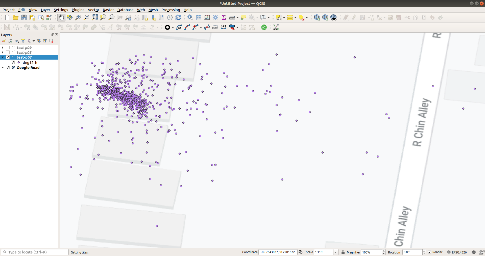
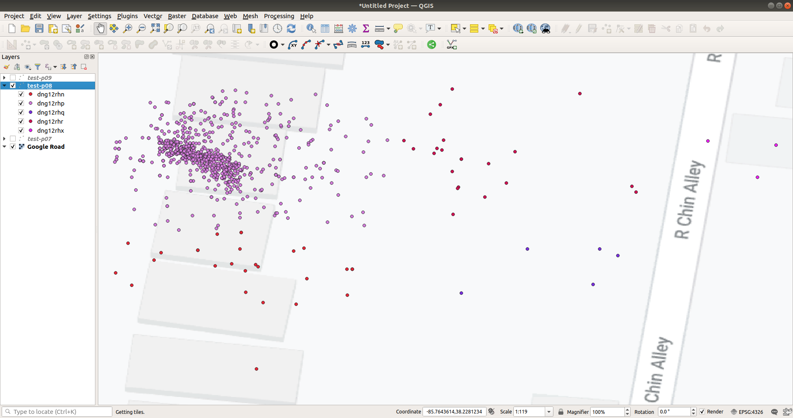
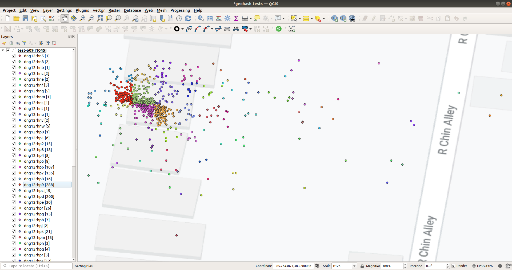

# LAT/LNG to geohash/geohash-coordinates

## Introduction

Look up lat/lng from a given input file and append geohash/geohash-coordinates to the input data onto a output file:

input | output
----- | ------
42.6 -5.6 | 42.6 -5.6 **ezs42e44yx96**
42.6 -5.6 | 42.6 -5.6 **ezs42e44yx96** **42.60223388671875 -5.5975341796875**

## Installation

Install `python3` and `pip3`
```
sudo apt install python3-pip
```
**or** (in case of *ModuleNotFoundError: No module named 'pip._internal'*)
```
python3 -m pip install --upgrade pip
```

Install `python-geohash`
```
pip install python-geohash
```
*Latest version of python-geohash may require python3.8 to run the script*

## Usage
```
python3 latlng2geohash.py -h/--help
```

**`TIPS:`**
Make sure to **sort** the input file on the **lat** and **lng** fields to reduce the processing time greatly.

## Notes

**The input must be `2 lines` long or more as they are required to determine the presence of headers**

Useful links to documentation and tools:
- This tool is based on [python-geohash](https://pypi.org/project/python-geohash)
- More info about geohashing [Wikipedia](https://en.wikipedia.org/wiki/Geohash)
- [Visual representation](http://mapzen.github.io/leaflet-spatial-prefix-tree) of geohashes
- [Online geohashing](https://www.movable-type.co.uk/scripts/geohash.html)

## Geohash length and cell size

Geohash length | | Cell width | | Cell height
-|-|-|-|-
1 | ≤ | 5,000km | x | 5,000km
2 | ≤ | 1,250km | x | 625km
3 | ≤ | 156km | x | 156km
4 | ≤ | 39.1km | x | 19.5km
5 | ≤ | 4.89km | x | 4.89km
6 | ≤ | 1.22km | x | 0.61km
7 | ≤ | 153m | x | 153m
8 | ≤ | 38.2m | x | 19.1m
9 | ≤ | 4.77m | x | 4.77m
10 | ≤ | 1.19m | x | 0.596m
11 | ≤ | 149mm | x | 149mm
12 | ≤ | 37.2mm | x | 18.6mm

### Visualization of length at residential building level

*geohash length of 7*       


*geohash length of 8*       


*geohash length of 9*       


